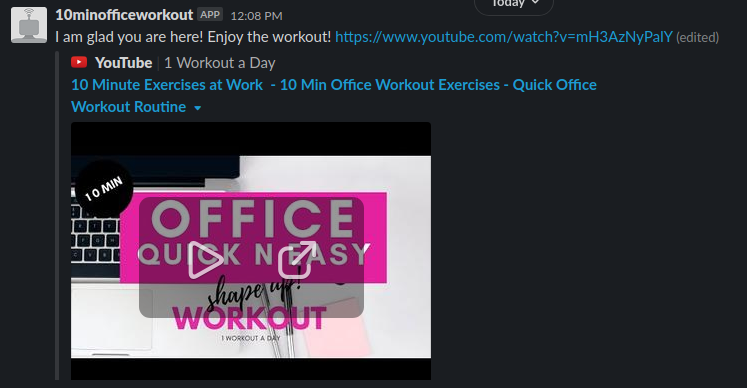

# 10 Minutes Office Workout for Slack.

This bot is part of the Capstone projects which are solo projects at the end of the each of the Microverse Main Technical Curriculum sections. This project intend to test the student skills providing challenges that:

- Feels like a real-world-like project, built with business specifications; and
- Get feedback about the achievement of technical and soft skills gained during the ruby section of the program.

Basically, this bot returns a random link video to a YouTube workout where people who works at home or offices can use to stretching.

## Disclaimer
I am not responsible for any injuries that might be caused by following the exercises on the videos, you should do the exercises at your own risk.

## Video Presentation

[Video Link](https://www.loom.com/share/d1e5391ef5084f389caea352b450dd95)

## Screenshots

## Build With

- Ruby
- Rubocop
- RSpec
- Celluloid-io
- Dotenv
- Puma
- Slack-ruby-bot

## Getting Started

# Prerequisites

Make sure you have a Slack Space to run the bot. 
To create one, [click here](https://slack.com/get-started#/create).
After you created a space directory, go to the App Directory of your newly created slack space and search for the Slack Bot app, search for the bot of Slack API, and then click in "Add to Slack", add the name '10minofficeworkout', and you will have generated a bot. Copy your [API Token](https://api.slack.com/legacy/custom-integrations/legacy-tokens) automatic generated code, that will be used to run the bot.

# Install

To test this bot in your locally, clone the repository, navigate to it's directory, and run:

$ bundle install  
$ echo 'SLACK_API_TOKEN=your_copied_token_here' > .env  
$ rackup  

- This should install all ruby gems;
- Generate an .env file containing the API token from the Setup; and 
- Start a local server where 10minofficeworkout will live.
  
# How to Use

Once you have locally installed the bot you can log in into your slack workspace and invite the bot to your channel, typing `/invite @10minofficeworkout`. 

Typing `@10minofficeworkout help` will return the following message:

10 Minutes Office Workout - Randomly get 10 minutes workouts that can be done in the confort of your office.
Commands:
get_workout - Returns a random link of YouTube workout that can be done at your office.
get_motivation - Returns a random motivational quote.
Other commands:
help - Shows help information.
hi - Says hello.
For getting description of the command use: help <command>
For more information see https://github.com/slack-ruby/slack-ruby-bot, please.

## Author

👤 **Carlos Veiga**

- Github: [@wrakc](https://github.com/wrakc)
- Twitter: [@carlosveig](https://twitter.com/carlosveig)
- Linkedin: [chveiga](https://linkedin.com/chveiga)

## 🤝 Contributing

Contributions, issues and feature requests are welcome!

Feel free to check the [issues page](issues/).

## Show your support

Give a ⭐️ if you like this project!

## Acknowledgments

- Thanks Microverse and The Minskins team.

## License

The gem is available as open source under the terms of the [MIT License](LICENSE.txt).
